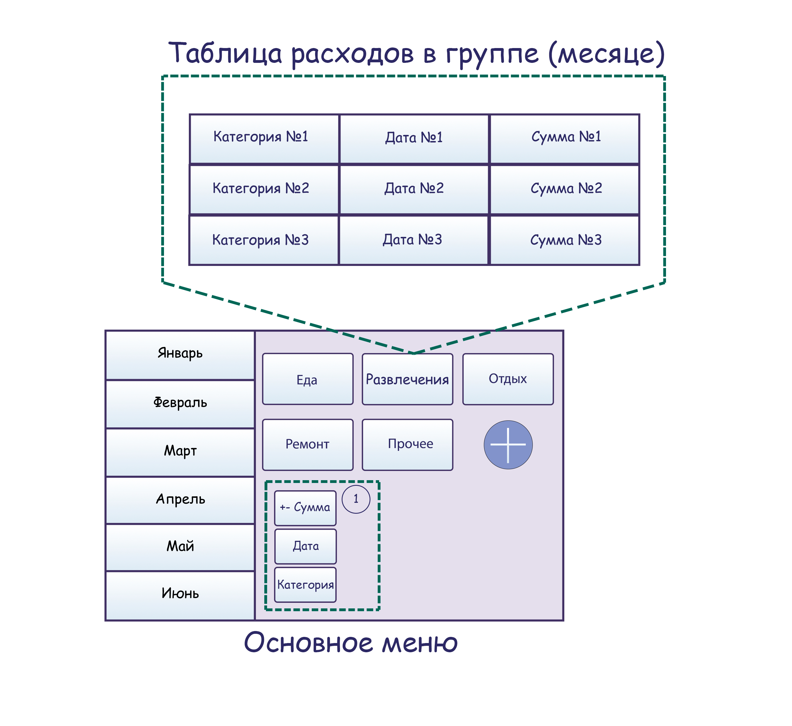
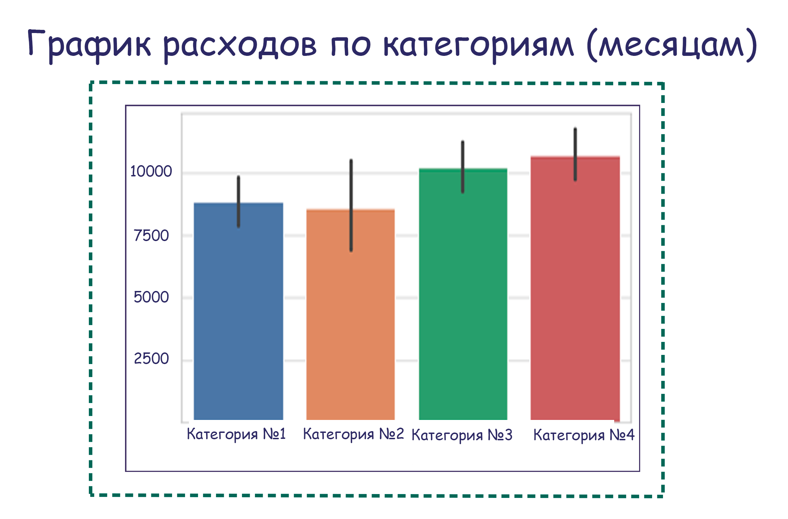

# Personal Finance Management App

## Участники
- Лисин Никита Олегович, 522, [https://github.com/Lorien2027/PythonDevelopment2021.git](https://github.com/Lorien2027/PythonDevelopment2021.git)
- Малюгин Дмитрий Валерьевич, 501, [https://github.com/s02200136/PythonDevelopment2021Spring.git](https://github.com/s02200136/PythonDevelopment2021Spring.git)

## Постановка задачи
Функциональность приложения позволяет вести статистику расходов по месяцам и отдельным группам объектов - "Основное меню". Для каждого месяца можно создать несколько групп, например: "Еда", "Развлечения", "Ремонт". Добавление расходов в группу происходит с помощью меню (обозначено номером 1), в котором необходимо указать сумму, дату и категорию для выбранной группы - например, категорией для группы "Еда" может быть конкретное название магазина, кафе или ресторана.

1. Каждая группа отображается в виде записей с указанием суммы, даты и категории - "Таблица расходов в группе (месяце)".
2. Дополнительным функционалом приложения является возможность визуализации записей в виде диаграммы - "График расходов по категориям (месяцам)".

## Интерфейс

----------

